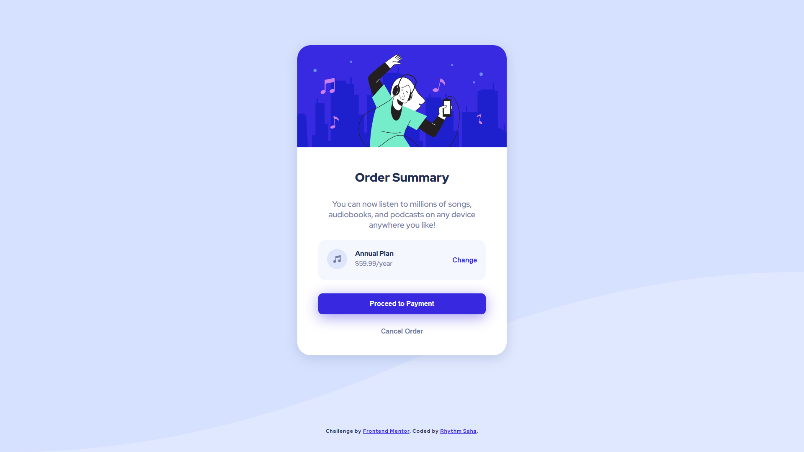

# Frontend Mentor - Order summary card solution

This is a solution to the [Order summary card challenge on Frontend Mentor](https://www.frontendmentor.io/challenges/order-summary-component-QlPmajDUj). Frontend Mentor challenges help you improve your coding skills by building realistic projects.

## Table of contents

- [Frontend Mentor - Order summary card solution](#frontend-mentor---order-summary-card-solution)
  - [Table of contents](#table-of-contents)
  - [Overview](#overview)
    - [The challenge](#the-challenge)
    - [Screenshot](#screenshot)
    - [Links](#links)
  - [My process](#my-process)
    - [Built with](#built-with)
  - [Author](#author)

**Note: Delete this note and update the table of contents based on what sections you keep.**

## Overview

### The challenge

Users should be able to:

-   See hover states for interactive elements

### Screenshot

### Links

-   Solution URL: [https://www.frontendmentor.io/solutions/ordersummarypagedesignwithhtmlcss-FNHS-a_aG](https://www.frontendmentor.io/solutions/ordersummarypagedesignwithhtmlcss-FNHS-a_aG)
-   Live Site URL: [https://rhythmsaha.github.io/order-summary-page-design/](https://rhythmsaha.github.io/order-summary-page-design/)

## My process

### Built with

-   Semantic HTML5 markup
-   CSS custom properties
-   Flexbox

## Author

-   Website - [Rhythm Saha](https://github.com/rhythmsaha)
-   Frontend Mentor - [@rhythmsaha](https://www.frontendmentor.io/profile/rhythmsaha)
